# Documento de Arquitectura Técnica - Portfolio Terminal

## 1. Diseño de Arquitectura

```mermaid
graph TD
  A[Usuario/Navegador] --> B[Aplicación Astro Frontend]
  B --> C[Componentes Terminal]
  B --> D[Gestión de Estado Local]
  B --> E[Archivos de Datos JSON]
  
  subgraph "Capa Frontend"
    B
    C
    D
    E
  end
  
  subgraph "Capa de Contenedores"
    F[Docker Container]
    G[Nginx Server]
  end
  
  B --> F
  F --> G
```



## 2. Descripción de Tecnologías

* Frontend: Astro\@4 + TypeScript + Tailwind CSS + Vite

* Contenedorización: Docker + Docker Compose

* Servidor Web: Nginx (para producción)

* Gestión de Estado: Vanilla JavaScript/TypeScript (sin frameworks adicionales)

## 3. Definiciones de Rutas

| Ruta      | Propósito                                                  |
| --------- | ---------------------------------------------------------- |
| /         | Página principal con terminal interactiva                  |
| /projects | Vista detallada de proyectos (accesible via comando)       |
| /skills   | Vista de tecnologías y habilidades (accesible via comando) |
| /about    | Información personal y profesional (accesible via comando) |
| /contact  | Formulario de contacto (accesible via comando)             |

## 4. Definiciones de API

### 4.1 API Principal

Datos estáticos servidos desde archivos JSON locales:

**Proyectos**

```typescript
interface Project {
  id: string;
  name: string;
  description: string;
  technologies: string[];
  github?: string;
  demo?: string;
  image?: string;
  highlights: string[];
}
```

**Habilidades Técnicas**

```typescript
interface Skill {
  name: string;
  category: 'frontend' | 'backend' | 'devops' | 'database' | 'tools';
  level: 1 | 2 | 3 | 4 | 5;
  icon?: string;
}
```

**Comandos de Terminal**

```typescript
interface Command {
  name: string;
  description: string;
  usage: string;
  action: () => void;
}
```

## 5. Diagrama de Arquitectura del Servidor


## 6. Modelo de Datos

### 6.1 Definición del Modelo de Datos


### 6.2 Lenguaje de Definición de Datos

**Estructura de Archivos de Datos**

```json
// src/data/portfolio.json
{
  "name": "Tu Nombre",
  "title": "Desarrollador Full Stack",
  "description": "Desarrollador apasionado por crear soluciones innovadoras",
  "email": "tu@email.com",
  "github": "https://github.com/tuusuario",
  "linkedin": "https://linkedin.com/in/tuusuario"
}

// src/data/projects.json
[
  {
    "id": "project-1",
    "name": "E-commerce Platform",
    "description": "Plataforma de comercio electrónico completa",
    "technologies": ["React", "Node.js", "MongoDB", "Stripe"],
    "github": "https://github.com/tuusuario/ecommerce",
    "demo": "https://demo.tudominio.com",
    "image": "/images/ecommerce.png",
    "highlights": [
      "Integración con pasarelas de pago",
      "Panel de administración completo",
      "Responsive design"
    ]
  }
]

// src/data/skills.json
[
  {
    "name": "JavaScript",
    "category": "frontend",
    "level": 5,
    "icon": "⚡"
  },
  {
    "name": "React",
    "category": "frontend",
    "level": 4,
    "icon": "⚛️"
  },
  {
    "name": "Node.js",
    "category": "backend",
    "level": 4,
    "icon": "🟢"
  },
  {
    "name": "Docker",
    "category": "devops",
    "level": 3,
    "icon": "🐳"
  }
]
```

## 7. Configuración de Docker

### 7.1 Dockerfile

```dockerfile
# Dockerfile
FROM node:18-alpine AS builder

WORKDIR /app

# Copiar archivos de dependencias
COPY package*.json ./
COPY bun.lock ./

# Instalar dependencias
RUN npm install

# Copiar código fuente
COPY . .

# Construir la aplicación
RUN npm run build

# Etapa de producción
FROM nginx:alpine

# Copiar archivos construidos
COPY --from=builder /app/dist /usr/share/nginx/html

# Copiar configuración de nginx
COPY nginx.conf /etc/nginx/nginx.conf

# Exponer puerto
EXPOSE 80

CMD ["nginx", "-g", "daemon off;"]
```

### 7.2 Docker Compose

```yaml
# docker-compose.yml
version: '3.8'

services:
  portfolio:
    build: .
    ports:
      - "3000:80"
    environment:
      - NODE_ENV=production
    volumes:
      - ./nginx.conf:/etc/nginx/nginx.conf:ro
    restart: unless-stopped
    networks:
      - portfolio-network

  # Opcional: Servicio de desarrollo
  portfolio-dev:
    build:
      context: .
      dockerfile: Dockerfile.dev
    ports:
      - "4321:4321"
    volumes:
      - .:/app
      - /app/node_modules
    environment:
      - NODE_ENV=development
    command: npm run dev
    networks:
      - portfolio-network
    profiles:
      - dev

networks:
  portfolio-network:
    driver: bridge
```

### 7.3 Dockerfile de Desarrollo

```dockerfile
# Dockerfile.dev
FROM node:18-alpine

WORKDIR /app

# Instalar dependencias globales
RUN npm install -g @astrojs/cli

# Copiar archivos de dependencias
COPY package*.json ./
COPY bun.lock ./

# Instalar dependencias
RUN npm install

# Exponer puerto de desarrollo
EXPOSE 4321

CMD ["npm", "run", "dev", "--", "--host"]
```

### 7.4 Configuración de Nginx

```nginx
# nginx.conf
events {
    worker_connections 1024;
}

http {
    include       /etc/nginx/mime.types;
    default_type  application/octet-stream;
    
    sendfile        on;
    keepalive_timeout  65;
    
    gzip on;
    gzip_vary on;
    gzip_min_length 1024;
    gzip_types text/plain text/css application/json application/javascript text/xml application/xml application/xml+rss text/javascript;
    
    server {
        listen       80;
        server_name  localhost;
        
        root   /usr/share/nginx/html;
        index  index.html index.htm;
        
        # Configuración para SPA
        location / {
            try_files $uri $uri/ /index.html;
        }
        
        # Cache para assets estáticos
        location ~* \.(js|css|png|jpg|jpeg|gif|ico|svg)$ {
            expires 1y;
            add_header Cache-Control "public, immutable";
        }
        
        # Configuración de seguridad
        add_header X-Frame-Options "SAMEORIGIN" always;
        add_header X-Content-Type-Options "nosniff" always;
        add_header X-XSS-Protection "1; mode=block" always;
    }
}
```

## 8. Scripts de Despliegue

### 8.1 Comandos de Docker

```bash
# Construcción y ejecución en producción
docker-compose up -d

# Desarrollo
docker-compose --profile dev up

# Reconstruir imagen
docker-compose build --no-cache

# Ver logs
docker-compose logs -f portfolio

# Detener servicios
docker-compose down
```

### 8.2 Package.json Scripts

```json
{
  "scripts": {
    "dev": "astro dev",
    "start": "astro dev",
    "build": "astro build",
    "preview": "astro preview",
    "docker:build": "docker-compose build",
    "docker:up": "docker-compose up -d",
    "docker:down": "docker-compose down",
    "docker:dev": "docker-compose --profile dev up",
    "docker:logs": "docker-compose logs -f portfolio"
  }
}
```

