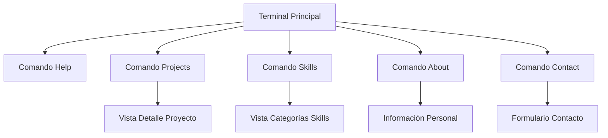

# Documento de Requerimientos del Producto - Portfolio Terminal

## 1. Descripción General del Producto

Portfolio personal interactivo con diseño de terminal/consola de comandos que simula una interfaz de línea de comandos para mostrar información profesional, proyectos y habilidades técnicas.

El producto permite a los visitantes navegar a través de comandos de terminal para explorar proyectos, tecnologías y experiencia profesional de manera innovadora e interactiva.

## 2. Características Principales

### 2.1 Roles de Usuario

| Rol | Método de Acceso | Permisos Principales |
|-----|------------------|----------------------|
| Visitante | Acceso directo sin registro | Puede ejecutar comandos de navegación, ver proyectos y tecnologías |
| Propietario | Acceso administrativo | Puede actualizar contenido, proyectos y configuraciones |

### 2.2 Módulo de Características

Nuestro portfolio terminal consta de las siguientes páginas principales:

1. **Terminal Principal**: interfaz de terminal interactiva, sistema de comandos, prompt personalizado, historial de comandos.
2. **Vista de Proyectos**: listado de proyectos, detalles técnicos, enlaces a repositorios, capturas de pantalla.
3. **Vista de Tecnologías**: categorización de habilidades, niveles de experiencia, iconos de tecnologías.
4. **Vista de Información Personal**: datos de contacto, experiencia profesional, educación.

### 2.3 Detalles de Páginas

| Nombre de Página | Nombre del Módulo | Descripción de Características |
|------------------|-------------------|--------------------------------|
| Terminal Principal | Interfaz de Terminal | Simular terminal con prompt personalizado, autocompletado de comandos, historial navegable |
| Terminal Principal | Sistema de Comandos | Implementar comandos: help, projects, skills, about, contact, clear, history |
| Terminal Principal | Animaciones de Texto | Efecto de escritura tipo máquina, cursor parpadeante, transiciones suaves |
| Vista de Proyectos | Listado de Proyectos | Mostrar proyectos con nombre, descripción, tecnologías usadas, enlaces |
| Vista de Proyectos | Detalles del Proyecto | Expandir información con capturas, características, desafíos resueltos |
| Vista de Tecnologías | Categorías de Skills | Organizar por Frontend, Backend, DevOps, Databases, Tools |
| Vista de Tecnologías | Indicadores de Nivel | Mostrar experiencia con barras de progreso o estrellas |
| Vista de Información | Datos Personales | Mostrar información de contacto, CV, redes sociales |
| Vista de Información | Experiencia Profesional | Timeline de experiencia laboral y educación |

## 3. Proceso Principal

El flujo principal del usuario comienza en la terminal donde puede ejecutar comandos para navegar:

1. **Flujo de Visitante**: Accede a la terminal → Ejecuta comando 'help' para ver opciones → Navega con comandos como 'projects', 'skills', 'about' → Explora contenido detallado → Puede contactar mediante comando 'contact'

## 4. Diseño de Interfaz de Usuario

### 4.1 Estilo de Diseño

- **Colores Primarios**: #00ff00 (verde terminal), #ffffff (texto), #000000 (fondo)
- **Colores Secundarios**: #ffff00 (amarillo para warnings), #ff0000 (rojo para errores)
- **Estilo de Botones**: Estilo terminal sin bordes, texto con cursor
- **Fuente**: Monospace (Fira Code, Consolas, Monaco)
- **Tamaños de Fuente**: 14px para terminal, 16px para títulos
- **Estilo de Layout**: Pantalla completa tipo terminal, padding mínimo
- **Iconos**: ASCII art y símbolos de terminal (>, $, #)

### 4.2 Resumen de Diseño de Páginas

| Nombre de Página | Nombre del Módulo | Elementos de UI |
|------------------|-------------------|----------------|
| Terminal Principal | Interfaz Terminal | Fondo negro, texto verde fosforescente, cursor parpadeante, prompt personalizado |
| Terminal Principal | Sistema de Comandos | Autocompletado con TAB, historial con flechas, comandos resaltados |
| Vista de Proyectos | Cards de Proyecto | Estilo ASCII boxes, texto monoespacio, enlaces subrayados |
| Vista de Tecnologías | Grid de Skills | Iconos ASCII, barras de progreso con caracteres, categorías separadas |
| Vista de Información | Perfil Personal | Formato tipo 'cat' de archivo, información estructurada |

### 4.3 Responsividad

El producto es mobile-first con adaptación táctil optimizada. En dispositivos móviles se incluye teclado virtual con comandos frecuentes y gestos de swipe para navegación rápida.